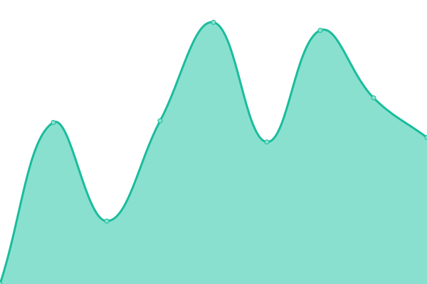

# [📈 Live Status](https://thomas-merz.github.io/upptime): <!--live status--> **🟧 Partial outage**

This repository contains the open-source uptime monitor and status page for [thomas-merz](https://thomas-merz.github.io/upptime), powered by [Upptime](https://github.com/upptime/upptime).

With [Upptime](https://upptime.js.org), you can get your own unlimited and free uptime monitor and status page, powered entirely by a GitHub repository. We use [Issues](https://github.com/thomas-merz/upptime/issues) as incident reports, [Actions](https://github.com/thomas-merz/upptime/actions) as uptime monitors, and [Pages](https://thomas-merz.github.io/upptime) for the status page.

<!--start: status pages-->
<!-- This summary is generated by Upptime (https://github.com/upptime/upptime) -->
<!-- Do not edit this manually, your changes will be overwritten -->
<!-- prettier-ignore -->
| URL | Status | History | Response Time | Uptime |
| --- | ------ | ------- | ------------- | ------ |
|  [dm-Homepage](https://www.dm.de/) | 🟩 Up | [dm-homepage.yml](https://github.com/thomas-merz/upptime/commits/HEAD/history/dm-homepage.yml) | 

 3548ms
     
 | 

<a href="https://thomas-merz.github.io/upptime/history/dm-homepage">100.00%</a>
    

|  1Password | 🟩 Up | [1-password.yml](https://github.com/thomas-merz/upptime/commits/HEAD/history/1-password.yml) | 

 714ms
     
 | 

<a href="https://thomas-merz.github.io/upptime/history/1-password">100.00%</a>
    

|  ADFS | 🟩 Up | [adfs.yml](https://github.com/thomas-merz/upptime/commits/HEAD/history/adfs.yml) | 

 796ms
     
 | 

<a href="https://thomas-merz.github.io/upptime/history/adfs">100.00%</a>
    

|  ALI | 🟩 Up | [ali.yml](https://github.com/thomas-merz/upptime/commits/HEAD/history/ali.yml) | 

 1327ms
     
 | 

<a href="https://thomas-merz.github.io/upptime/history/ali">100.00%</a>
    

|  Alpha | 🟩 Up | [alpha.yml](https://github.com/thomas-merz/upptime/commits/HEAD/history/alpha.yml) | 

 852ms
     
 | 

<a href="https://thomas-merz.github.io/upptime/history/alpha">100.00%</a>
    

|  bitwarden | 🟩 Up | [bitwarden.yml](https://github.com/thomas-merz/upptime/commits/HEAD/history/bitwarden.yml) | 

 633ms
     
 | 

<a href="https://thomas-merz.github.io/upptime/history/bitwarden">100.00%</a>
    

|  Condeco | 🟩 Up | [condeco.yml](https://github.com/thomas-merz/upptime/commits/HEAD/history/condeco.yml) | 

 520ms
     
 | 

<a href="https://thomas-merz.github.io/upptime/history/condeco">99.16%</a>
    

|  Crowdstrike Dashboard | 🟩 Up | [crowdstrike-dashboard.yml](https://github.com/thomas-merz/upptime/commits/HEAD/history/crowdstrike-dashboard.yml) | 

 507ms
     
 | 

<a href="https://thomas-merz.github.io/upptime/history/crowdstrike-dashboard">100.00%</a>
    

|  dm-DWH | 🟥 Down | [dm-dwh.yml](https://github.com/thomas-merz/upptime/commits/HEAD/history/dm-dwh.yml) | 

 656ms
     
 | 

<a href="https://thomas-merz.github.io/upptime/history/dm-dwh">99.99%</a>
    

|  dm-GPT | 🟩 Up | [dm-gpt.yml](https://github.com/thomas-merz/upptime/commits/HEAD/history/dm-gpt.yml) | 

 922ms
     
 | 

<a href="https://thomas-merz.github.io/upptime/history/dm-gpt">100.00%</a>
    

|  dm-IAM | 🟩 Up | [dm-iam.yml](https://github.com/thomas-merz/upptime/commits/HEAD/history/dm-iam.yml) | 

 835ms
     
 | 

<a href="https://thomas-merz.github.io/upptime/history/dm-iam">100.00%</a>
    

|  dm-Rechnungen | 🟩 Up | [dm-rechnungen.yml](https://github.com/thomas-merz/upptime/commits/HEAD/history/dm-rechnungen.yml) | 

 1109ms
     
 | 

<a href="https://thomas-merz.github.io/upptime/history/dm-rechnungen">100.00%</a>
    

|  dm-SAP | 🟩 Up | [dm-sap.yml](https://github.com/thomas-merz/upptime/commits/HEAD/history/dm-sap.yml) | 

 2908ms
     
 | 

<a href="https://thomas-merz.github.io/upptime/history/dm-sap">100.00%</a>
    

|  dm-Sharepoint | 🟩 Up | [dm-sharepoint.yml](https://github.com/thomas-merz/upptime/commits/HEAD/history/dm-sharepoint.yml) | 

 498ms
     
 | 

<a href="https://thomas-merz.github.io/upptime/history/dm-sharepoint">100.00%</a>
    

|  dm-Travel | 🟩 Up | [dm-travel.yml](https://github.com/thomas-merz/upptime/commits/HEAD/history/dm-travel.yml) | 

 672ms
     
 | 

<a href="https://thomas-merz.github.io/upptime/history/dm-travel">100.00%</a>
    

|  Gitlab | 🟩 Up | [gitlab.yml](https://github.com/thomas-merz/upptime/commits/HEAD/history/gitlab.yml) | 

 752ms
     
 | 

<a href="https://thomas-merz.github.io/upptime/history/gitlab">96.01%</a>
    

|  Jira | 🟩 Up | [jira.yml](https://github.com/thomas-merz/upptime/commits/HEAD/history/jira.yml) | 

 1077ms
     
 | 

<a href="https://thomas-merz.github.io/upptime/history/jira">100.00%</a>
    

|  [Microsoft Login](https://login.microsoft.com) | 🟩 Up | [microsoft-login.yml](https://github.com/thomas-merz/upptime/commits/HEAD/history/microsoft-login.yml) | 

 468ms
     
 | 

<a href="https://thomas-merz.github.io/upptime/history/microsoft-login">100.00%</a>
    

|  [Microsoft Teams](https://teams.microsoft.com) | 🟩 Up | [microsoft-teams.yml](https://github.com/thomas-merz/upptime/commits/HEAD/history/microsoft-teams.yml) | 

 184ms
     
 | 

<a href="https://thomas-merz.github.io/upptime/history/microsoft-teams">100.00%</a>
    

|  [Microsoft Outlook](https://outlook.office.com) | 🟩 Up | [microsoft-outlook.yml](https://github.com/thomas-merz/upptime/commits/HEAD/history/microsoft-outlook.yml) | 

 73ms
     
 | 

<a href="https://thomas-merz.github.io/upptime/history/microsoft-outlook">100.00%</a>
    

|  Nutrax | 🟩 Up | [nutrax.yml](https://github.com/thomas-merz/upptime/commits/HEAD/history/nutrax.yml) | 

 1262ms
     
 | 

<a href="https://thomas-merz.github.io/upptime/history/nutrax">100.00%</a>
    

|  Planisware | 🟩 Up | [planisware.yml](https://github.com/thomas-merz/upptime/commits/HEAD/history/planisware.yml) | 

 1009ms
     
 | 

<a href="https://thomas-merz.github.io/upptime/history/planisware">100.00%</a>
    

|  Rubrik Cloud | 🟩 Up | [rubrik-cloud.yml](https://github.com/thomas-merz/upptime/commits/HEAD/history/rubrik-cloud.yml) | 

 275ms
     
 | 

<a href="https://thomas-merz.github.io/upptime/history/rubrik-cloud">100.00%</a>
    

|  Team-MkDocs | 🟩 Up | [team-mk-docs.yml](https://github.com/thomas-merz/upptime/commits/HEAD/history/team-mk-docs.yml) | 

 1153ms
     
 | 

<a href="https://thomas-merz.github.io/upptime/history/team-mk-docs">100.00%</a>
    

|  VPN | 🟩 Up | [vpn.yml](https://github.com/thomas-merz/upptime/commits/HEAD/history/vpn.yml) | 

 441ms
     
 | 

<a href="https://thomas-merz.github.io/upptime/history/vpn">100.00%</a>
    

|  Wiki | 🟩 Up | [wiki.yml](https://github.com/thomas-merz/upptime/commits/HEAD/history/wiki.yml) | 

 658ms
     
 | 

<a href="https://thomas-merz.github.io/upptime/history/wiki">100.00%</a>
    

<!--end: status pages-->

[**Visit our status website →**](https://thomas-merz.github.io/upptime)

## 📄 License

- Powered by: [Upptime](https://github.com/upptime/upptime)
- Code: [MIT](./LICENSE) © [thomas-merz](https://thomas-merz.github.io/upptime)
- Data in the `./history` directory: [Open Database License](https://opendatacommons.org/licenses/odbl/1-0/)
